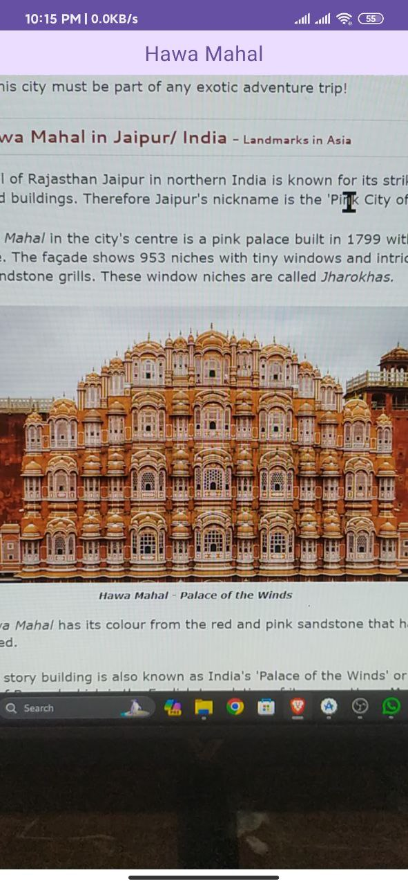
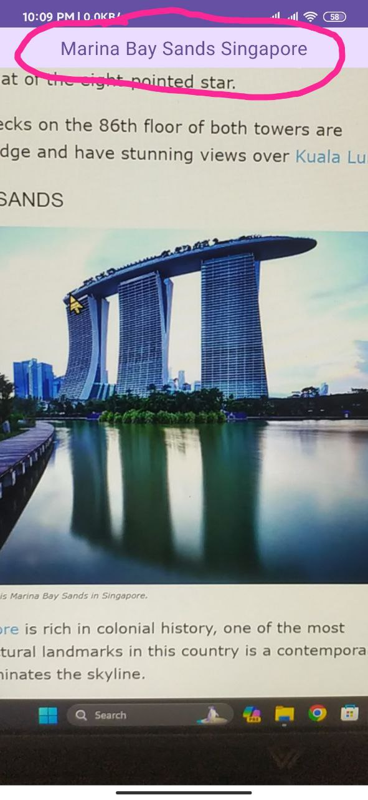

# 🏯 Landmark Recognition App (Asia)

**Landmark Recognition** is an Android application built with **Kotlin** and **Jetpack Compose** that identifies popular landmarks across Asia using a machine learning model. Users can take a photo and the app will detect and display the name of the landmark.

---

## 📸 Features

- 📷 Capture image
- 🧠 Real-time ML-based landmark recognition (focused on Asian landmarks)
- 🗺️ Displays the recognized landmark name
- ⚡ Fast and intuitive user interface

---

## 🛠️ Tech Stack

- **Language**: Kotlin
- **UI**: Jetpack Compose
- **Architecture**: MVVM
- **Machine Learning**: TensorFlow Lite model integration
- **Image Handling**: CameraX

---

## 🌏 Landmark Coverage

Currently supports recognition of major landmarks across Asian countries such as:
- Taj Mahal (India)
- Great Wall of China (China)
- Petronas Towers (Malaysia)
- Marina Bay Sands (Singapore)
- Tokyo Tower (Japan)
- and more...

---

---

## 📸 Screenshots

| Landmark 1 | Landmark 2 | Landmark 3 |
|---------|--------------|--------------|
|  |  |  |

---

## 📧 Contact

**Md Rasel Rahman**  
📍 Jashore, Bangladesh  
📫 [LinkedIn](https://www.linkedin.com/in/rasel093/) | [GitHub](https://github.com/rasel-093)
---

## 🤖 Acknowledgements

Special thanks to open-source machine learning datasets and models that made landmark recognition possible.

